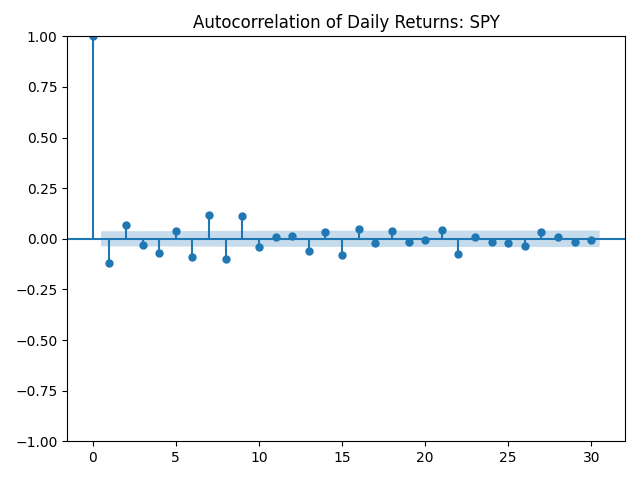
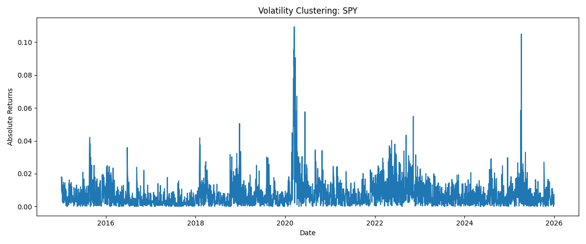
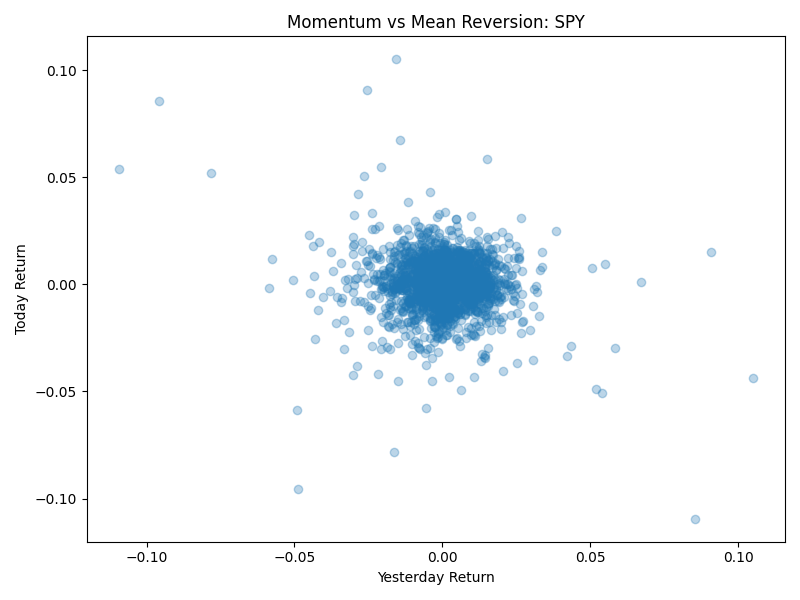
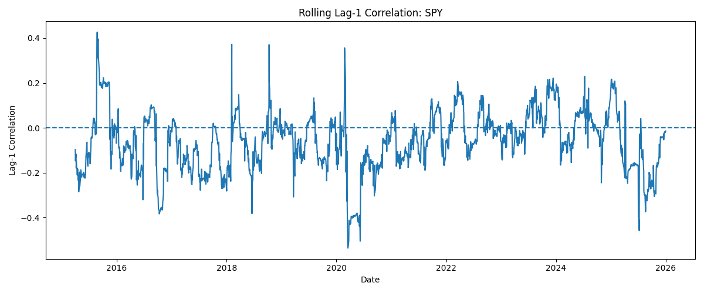

# Temporal Correlation Analysis of Financial Time Series

A quantitative finance project analysing temporal dependence, autocorrelation, volatility clustering, and regime-dependent market behaviour in financial time series.

## Overview

This project investigates whether daily equity returns contain temporal structure and whether market behaviour exhibits momentum, mean reversion, or volatility persistence.

The analysis focuses on SPY as a proxy for the US equity market.

## Methods

The project includes:

- Historical market data collection
- Daily return computation
- Autocorrelation analysis
- Lag-1 return correlation
- Momentum vs mean-reversion diagnostics
- Volatility clustering analysis
- Rolling temporal correlation analysis

## Key Results

### 1. Autocorrelation of Daily Returns

Daily SPY returns show weak autocorrelation, suggesting limited direct predictability from past returns.

### 2. Volatility Clustering

Absolute returns show clear clustering, indicating that market volatility is persistent over time.

### 3. Momentum vs Mean Reversion

Lag-1 correlation was found to be mildly negative, suggesting weak short-term mean reversion.

### 4. Rolling Temporal Correlation

Rolling lag-1 correlation shows that market memory is regime-dependent rather than constant.

## Key Insight

Daily returns are difficult to predict directly, but volatility exhibits temporal persistence. This supports the idea that market risk has memory even when returns themselves appear close to random.

## Skills Demonstrated

- Financial time-series analysis
- Autocorrelation modelling
- Volatility clustering
- Rolling-window statistics
- Momentum and mean-reversion diagnostics
- Python: Pandas, NumPy, Statsmodels, Matplotlib

## Repository Structure

data/  
figures/  
notebooks/  
src/
