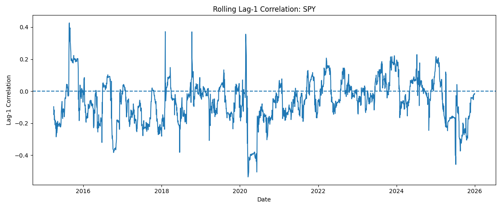

# Temporal Correlation Analysis of Financial Time Series

A quantitative finance project analysing temporal dependence, autocorrelation, volatility clustering, and regime-dependent market behaviour in financial time series.

## Overview

This project investigates whether daily equity returns contain temporal structure and whether market behaviour exhibits momentum, mean reversion, or volatility persistence.

The analysis focuses on SPY as a proxy for the US equity market.

## Methods

The project includes:

- Historical market data collection
- Daily return computation
- Autocorrelation analysis
- Lag-1 return correlation
- Momentum vs mean-reversion diagnostics
- Volatility clustering analysis
- Rolling temporal correlation analysis

## Key Results

### 1. Autocorrelation of Daily Returns

Daily SPY returns show no statistically significant autocorrelation at any lag from 1 to 30 days -- every point falls inside the shaded 95% confidence band (roughly ±0.04). The first 10 lags range from -0.12 to +0.12 with no consistent sign or decay pattern, consistent with white noise. This is direct evidence for weak-form market efficiency: past daily returns contain no detectable linear information about future returns at these horizons.

### 2. Volatility Clustering

Absolute returns show visible bursts of activity, suggesting market volatility is persistent over time rather than evenly spread out.

To formally test this rather than relying on visual inspection, I computed the autocorrelation of absolute returns. Every lag from 1 to 30 days sits well outside the 95% confidence band (roughly 0.25-0.39 versus a band of about ±0.06), confirming genuine, statistically significant clustering -- in sharp contrast to raw returns, which show no such structure at any lag.

### 3. Momentum vs Mean Reversion

The lag-1 scatter of today's return against yesterday's forms a roughly circular, untilted cloud centred at the origin, consistent with the near-zero correlation found above. The density near the origin reflects that most daily returns are small in magnitude, not evidence of predictability; a genuine momentum or mean-reversion effect would show up as a diagonal tilt in the cloud, which is not present here.

### 4. Rolling Correlation

The unconditional lag-1 correlation above is close to zero, but that average masks real, time-varying structure. A 60-day rolling lag-1 correlation swings between roughly +0.4 and -0.4 over the sample period, rather than staying flat, indicating that predictability is regime-dependent rather than a stable feature of the market. The most striking example is a sharp swing toward negative (mean-reverting) correlation during the 2020 crash, when large moves tended to partially reverse the following day far more than the long-run average would suggest.

## Key Insight

Daily returns are difficult to predict directly, but volatility exhibits temporal persistence. This supports the idea that market risk has memory even when returns themselves appear close to random.

## Skills Demonstrated

- Financial time-series analysis
- Autocorrelation modelling
- Volatility clustering
- Rolling-window statistics
- Momentum and mean-reversion diagnostics
- Python: Pandas, NumPy, Statsmodels, Matplotlib

## Repository Structure

data/  
figures/  
notebooks/  
src/
